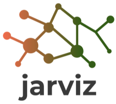
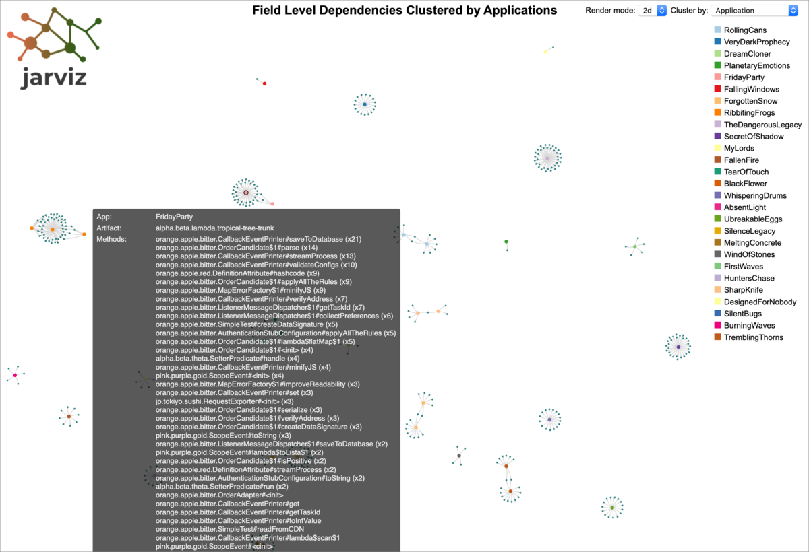
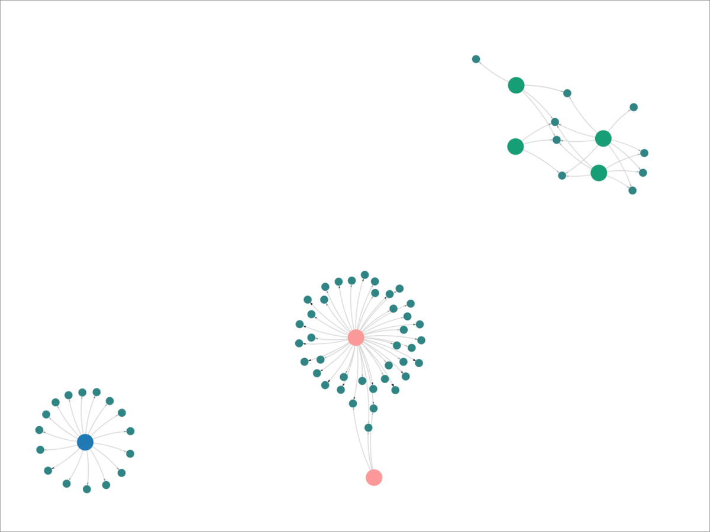

# Jarviz [](https://github.com/ExpediaGroup/jarviz/actions)

**Jarviz** is a dependency analysis tool designed for Java applications. Jarviz can provide a complete graph of couplings between Java methods across artifacts. Since non-private methods in a class can be accessed by other classes, method calls can be intertwined creating multifold couplings among each other. By analyzing the Java bytecode deeply, Jarviz can reveal these couplings in a user-friendly format.

| :information_source: | Learn more about Jarviz on the [Expedia Group Technology blog](https://medium.com/expedia-group-tech/jarviz-can-you-show-my-application-couplings-a9e57f7f76a7) |
| -------------------- | --------------------- |

Jarviz consists of 3 components:

### Jarviz Library ([jarviz-lib](jarviz-lib))

This Java library scans the Java [bytecode](https://docs.oracle.com/javase/specs/jvms/se8/html/jvms-6.html) of binary artifacts using a custom classloader and generates the dependency coupling data as a [JSON Lines (.jsonl)](http://jsonlines.org) file. Currently only JAR and WAR artifact formats are supported. To find the dependency couplings, Jarviz analyzes the [opcodes](https://docs.oracle.com/javase/specs/jvms/se8/html/jvms-6.html) using [ASM](https://asm.ow2.io) bytecode analysis framework.

### Jarviz Graph Tool ([jarviz-graph](jarviz-graph))

Jarviz Graph is a Node application to read the dependency coupling data and generate the dependency graph as an HTML file. The dependency coupling data, provided as a [JSON Lines (.jsonl)](http://jsonlines.org) input file, is generated from the Jarviz Java library.

### Jarviz CLI Tool ([jarviz-cli](jarviz-cli))

Jarviz CLI is a command-line tool designed for \*nix systems to perform dependency analysis for Java applications. Internally it uses both the Jarviz Java library and Jarviz graph tool to provide a useful command-line interface to the user.

## Quick Start

- Prerequisite: Verify that [java](https://openjdk.java.net), [maven](https://maven.apache.org), [node](https://nodejs.org) and [npm](https://www.npmjs.com/get-npm) are installed in the system.
  - Java and Maven are required to download Java libraries.
  - Node and NPM are required to download Node modules.
- Checkout the project from GitHub and change the directory to `jarviz-cli` module.
- Run `./jarviz graph -f samples/filter.json -a samples/artifacts.json`
- Open the generated HTML file in the browser.

## Samples

### Sample Dependency Graph





### Sample Coupling Data

```json
{
  "appSetName": "FooPortfolio",
  "applicationName": "MyApp",
  "artifactFileName": "foo-product-1.2.1.jar",
  "artifactId": "foo-product",
  "artifactGroup": "com.foo.bar",
  "artifactVersion": "1.2.1",
  "sourceClass": "foo.bar.MyClass",
  "sourceMethod": "doFirstTask",
  "targetClass": "foo.bar.YourClass",
  "targetMethod": "getProductId"
}↵
...
```

## Dependency Couplings

### What is a coupling?

A coupling is a dependency between two methods. Let's say method `hello` of class `com.xyz.Alpha` calls the method `world` of class `com.xyz.Beta`. Then there is a dependency coupling between those two methods and Jarviz represents that coupling this way:

| Source Class    | Source Method | Target Class   | Target Method |
| --------------- | ------------- | -------------- | ------------- |
| `com.xyz.Alpha` | `hello`       | `com.xyz.Beta` | `world`       |

### Why field level dependencies?

There are many tools capable of generating dependency graphs either down to the class or library level. This is useful information to have when you are supporting an application. It is also very important to know the dependencies down to the field level access. Jarviz provides a way to generate dependency coupling data down to field level (assuming that the internal state of the fields are accessed via method calls). Jarviz will analyze deeply inside the methods, including lambda functions to extract the dependency data.

#### Sample Couplings

In the Java source code shown below, the class `com.mycompany.MySource` calls methods from two classes namely `com.xyz.foo.Alpha` and `com.xyz.bar.Beta`.

```java
package com.xyz.foo;
public class Alpha {

    private final int val;

    public Alpha(final int val) {
        this.val = val;
    }

    public int getVal() {
        return val;
    }
}
```

```java
package com.xyz.bar;
public class Beta {

    public int getBetaIntVal(final String value) {
        return Integer.parseInt(value);
    }

    public long getBetaLongVal(final String value) {
        return Long.parseLong(value);
    }

    public Alpha getBetaAlphaVal(final String value) {
        return new Alpha(Integer.parseInt(value));
    }
}
```

```java
package com.mycompany;
public class MySource {

    private static int MY_STATIC_VAR = new Alpha(1).getVal();

    private int myInstanceAlphaValue = new Alpha(2).getVal();

    public int callBeta1() {
        return new Beta().getBetaIntVal("10");
    }

    public int callBeta2() {
        return new Beta().getBetaIntVal("20");
    }

    public int callAlpha1() {
        return new Alpha(10).getVal();
    }

    public int callAlphaBeta() {
        return new Beta().getBetaAlphaVal("30").getVal();
    }

    public long callLambda(final List<String> values) {
        return values.stream()
                     .filter(a -> !a.isEmpty())
                     .map(a -> new Beta().getBetaLongVal(a))
                     .count();
    }
}
```

If `com.mycompany.MySource` class is analyzed with Jarviz for the usage of any classes in the `com.xyz` package, it will find the following dependency couplings:

| Source Class             | Source Method         | Target Class        | Target Method     |
| ------------------------ | --------------------- | ------------------- | ----------------- |
| `com.mycompany.MySource` | `<clinit>`            | `com.xyz.foo.Alpha` | `<init>`          |
| `com.mycompany.MySource` | `<clinit>`            | `com.xyz.foo.Alpha` | `getVal`          |
| `com.mycompany.MySource` | `<init>`              | `com.xyz.foo.Alpha` | `<init>`          |
| `com.mycompany.MySource` | `<init>`              | `com.xyz.foo.Alpha` | `getVal`          |
| `com.mycompany.MySource` | `callBeta1`           | `com.xyz.bar.Beta`  | `<init>`          |
| `com.mycompany.MySource` | `callBeta1`           | `com.xyz.bar.Beta`  | `getBetaIntVal`   |
| `com.mycompany.MySource` | `callBeta2`           | `com.xyz.bar.Beta`  | `<init>`          |
| `com.mycompany.MySource` | `callBeta2`           | `com.xyz.bar.Beta`  | `getBetaIntVal`   |
| `com.mycompany.MySource` | `callAlpha1`          | `com.xyz.foo.Alpha` | `<init>`          |
| `com.mycompany.MySource` | `callAlpha1`          | `com.xyz.foo.Alpha` | `getVal`          |
| `com.mycompany.MySource` | `callAlphaBeta`       | `com.xyz.foo.Alpha` | `getVal`          |
| `com.mycompany.MySource` | `callAlphaBeta`       | `com.xyz.bar.Beta`  | `<init>`          |
| `com.mycompany.MySource` | `callAlphaBeta`       | `com.xyz.bar.Beta`  | `getBetaAlphaVal` |
| `com.mycompany.MySource` | `lambda$callLambda$1` | `com.xyz.bar.Beta`  | `<init>`          |
| `com.mycompany.MySource` | `lambda$callLambda$1` | `com.xyz.bar.Beta`  | `getBetaLongVal`  |

## Development

### Initial Setup

Clone the Jarviz project locally from the GitHub repo, and verify it builds properly.

**Jarviz Library**

```shell
$ mvn clean install
```

**Jarviz Graph Tool**

```shell
$ npm install
$ npm run build:example
```

**Jarviz CLI Tool**

```shell
$ ./jarviz
```

### How to Contribute

If you are enthusiastic about contributing to Jarviz development, please send a pull request.

## Contact

This project is an open source software by Expedia Group and maintained by [ExpediaGroup/teams/jarviz-committers](https://github.com/orgs/ExpediaGroup/teams/jarviz-committers/). For support discussions please join [Jarviz Google group](https://groups.google.com/forum/#!forum/jarviz).

## Legal

This project is available under the [Apache 2.0 License](http://www.apache.org/licenses/LICENSE-2.0.html).

Copyright 2019 Expedia, Inc.
